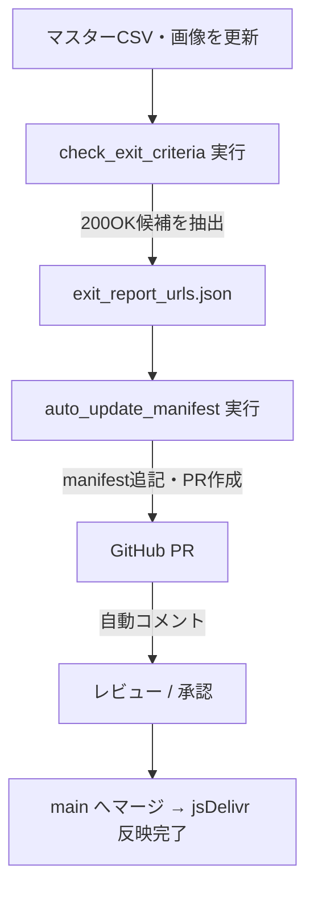

# 📘 HL001 DX オートメーションシステム 解説ドキュメント

**対象**：初学者（非エンジニア）  
**目的**：HL001（カラコンアカデミア）で運用している自動検証・自動反映の仕組みを、背景と使い方まで分かりやすくまとめます。

---

## 1️⃣ 概要と目的

### 💡 なぜ必要？

HL001 では大量のクイズデータや商品画像（E/I/J/K列で表す商品キー）を扱うため、手作業だと「漏れ」「重複」「リンク切れ」が起きやすく、業務が止まるリスクがあります。  
そこで Codex（AI）により、以下の自動化ラインを整備しました。

| 機能 | 目的 |
| --- | --- |
| ✅ 自動検証スクリプト | データと画像の整合性をチェック |
| ⚙️ 自動反映スクリプト | 問題ない画像URLだけ manifest.json に追加 |
| 🔄 CI（継続的検証） | GitHub で毎回チェックを可視化 |
| 🌐 CDN リベース | 画像URLを GitHub → jsDelivr へ置換 |
| 💬 PR自動コメント | PRに差分表とパッチを自動投稿 |

---

## 2️⃣ 実装済みツール一覧

| 区分 | ファイル名 | 役割 |
| --- | --- | --- |
| Nodeスクリプト | `tools/check_exit_criteria.js` | CSV・manifest・画像の整合性チェック |
| GASスクリプト | `tools/check_exit_criteria_gas.gs` | Google Sheets 上で欠損・HTTP200チェック |
| GitHub Actions | `.github/workflows/exit_check.yml` | push / PR 時に自動検証 |
| 自動反映 | `tools/auto_update_manifest.js` (v4) | 200 OK の画像だけ manifest.json に追記 & PR作成 / コメント投稿 |
| 置換補助 | `tools/rebase_urls_repo_wide.js` | リポジトリの URL を CDN 形式へ安全に置換 |
| CI反映 | `.github/workflows/manifest_autoupdate.yml` | manifest の自動更新と PR 作成 |

---

## 3️⃣ 各ツールの説明と運用手順

### 🧩 A. `check_exit_criteria.js`（ローカル / CI）

**目的**：マスターCSVの E/I/J/K と manifest.json、画像フォルダの一致を検証  
**使い方**：

```bash
node tools/check_exit_criteria.js
```

**出力例**：

```
EXIT-CRITERIA:
schema✅ E/I/J/K一致✅ 画像リンク⚠️ manifest連携✅ 欠損⚠️ 除外✅
```

**チェック内容**：
- E/I/J/K の組み合わせ重複
- 必須列（E/I/J/K）が空欄
- manifest.json に存在しない CK
- 画像ファイル（lens/samune）の存在

---

### 🧾 B. `check_exit_criteria_gas.gs`（Google Sheets）

**目的**：スプレッドシート上で直接検証 + HTTP 200 応答確認  
**実行手順**：
1. GAS にスクリプトを貼り付ける
2. [スクリプトのプロパティ] で `SHEET_ID`, `MANIFEST_URL` 等を設定
3. `runExitCriteriaCheck()` を実行

**出力**：
- `Logger` に EXIT-CRITERIA 行を表示
- `ValidationLog` シートに時系列で判定を追記
- `SuggestedManifest` に CK ごとの候補URL（HTTPコード付き）を出力
- `UrlCheckLog` に個別URLとHTTPコードを記録

---

### 🔁 C. `auto_update_manifest.js`（自動反映 & PR作成）

**目的**：HTTP 200 の画像 URL を manifest.json に追記し、GitHub PR を自動で作成  
**主な機能**：
- `exit_report_urls.json` を読み込み、200 の `suggest.lens / suggest.samune` のみ採用
- `manifest.json` に欠落分だけ追加（既存データを壊さない）
- 既存 URL も `REBASE_FROM → REBASE_TO` で CDN 形式に変換（オプション）
- git commit → ブランチ作成 → PR 作成
- PR本文に差分表（Before/After/HTTPコード/ステータス）が自動挿入
- `AUTO_PR_COMMENT=1` で PR に差分表＋ diff のコメントを投稿

**差分表イメージ（PR内）**：

| CK | Action | Before | HTTP | OK | After | HTTP | OK |
| --- | --- | --- | --- | :-: | --- | --- | :-: |
| AEL0001_アイエクリプス_グレムーン_1day | add.lens | *(空)* | — |  | https://cdn.example/lens.jpg | 200 | ✅ |
| 同上 | add.samune | *(空)* | — |  | https://cdn.example/samune.jpg | 200 | ✅ |

---

### 🌐 D. `rebase_urls_repo_wide.js`（CDNへの一括置換）

**目的**：リポジトリ全体で指定URLを置換（例：raw → jsDelivr）  
**使い方**：

```bash
REBASE_FROM="https://raw.githubusercontent.com/owner/repo/main" \
REBASE_TO="https://cdn.jsdelivr.net/gh/owner/repo@main" \
DRY_RUN=1 node tools/rebase_urls_repo_wide.js   # プレビュー
```

- 対象拡張子や除外ディレクトリは環境変数でカスタマイズ
- DRY_RUN=1 で差分だけ確認 → 問題なければ DRY_RUN を外して適用

---

### 🤖 E. GitHub Actions

#### `.github/workflows/exit_check.yml`
- push / pull_request 時に `check_exit_criteria.js` を実行
- 結果は `exit_report.txt` として保存

#### `.github/workflows/manifest_autoupdate.yml`
- manifest の自動更新 (DRY_RUN のプレビュー → 本番適用)
- PRタイトル・本文・レビュアーの指定
- `AUTO_PR_COMMENT=1` でコメント投稿も自動化

---

### 🛠 補足スクリプト・実行コマンド

`package.json` の scripts に、以下のコマンドを追加済みです（VS Code ターミナルで実行可能）。

| コマンド | 内容 |
| --- | --- |
| `npm run manifest:dry` | manifest 自動更新の結果をプレビュー |
| `npm run manifest:update` | manifest 自動更新 → PR作成（本番） |
| `npm run rebase:urls` | URL 置換ツール（DRY_RUN 指定推奨） |

---

## 4️⃣ 全体フロー（自動チェック → 自動反映）



---

## 5️⃣ 効果とメリット

| 効果 | 説明 |
| --- | --- |
| 🧠 ヒューマンエラー削減 | 欠損・重複・リンク切れを自動検出、手戻りを最小化 |
| ⏱ 作業時間短縮 | 手でチェックしていた作業を秒で完了 |
| 📊 可視化 | PRに「何が変わったか」が表と diff で明示される |
| 🔄 運用一貫性 | 全員が同じフローで更新できる |
| 🌐 CDN最適化 | raw URLを jsDelivr に揃え、高速配信 |
| 🧩 拡張性 | 音声・動画など他リソースにも同じ検証を転用できる |

---

## 🪄 専門用語の注釈

| 用語 | 説明 |
| --- | --- |
| manifest.json | アプリが画像やメタ情報を取得する台帳ファイル |
| HTTP 200 | 「このURLは正常にアクセスできました」の合図 |
| PR（Pull Request） | GitHub の変更をレビュー・マージする仕組み |
| CI（Continuous Integration） | 変更ごとに自動テスト・検証を回す仕組み |
| jsDelivr (CDN) | GitHub のファイルを高速配信するサービス |
| DRY_RUN | 実際には変更を書き込まず挙動を確認するモード |

---

## 💡 運用ポイント

1. **データ更新前に必ず `check_exit_criteria` 実行** → 問題の早期発見  
2. **manifest更新は `auto_update_manifest` に任せる** → 正しいPRが自動で上がる  
3. **CDN URLの統一** → クイズ/ECの表示速度向上と将来の移行容易化  
4. **PR本文やコメントの表をレビューに活かす** → 承認が速くなる  

---

### ✨ まとめ

> 「人間が目で探す作業」から「AIとスクリプトが判断する作業」へ置き換え、  
> **ミスなく／速く／説明しやすい** クオリティ管理を実現するための仕組みです。

この説明書をインストール操作や引き継ぎ教育に活用し、HL001 のデータ運用を“省力化＋高品質”で回していきましょう。

EXIT-CRITERIA: spec✅ acceptance-criteria✅ diagrams✅ traceability✅ open-issues✅
