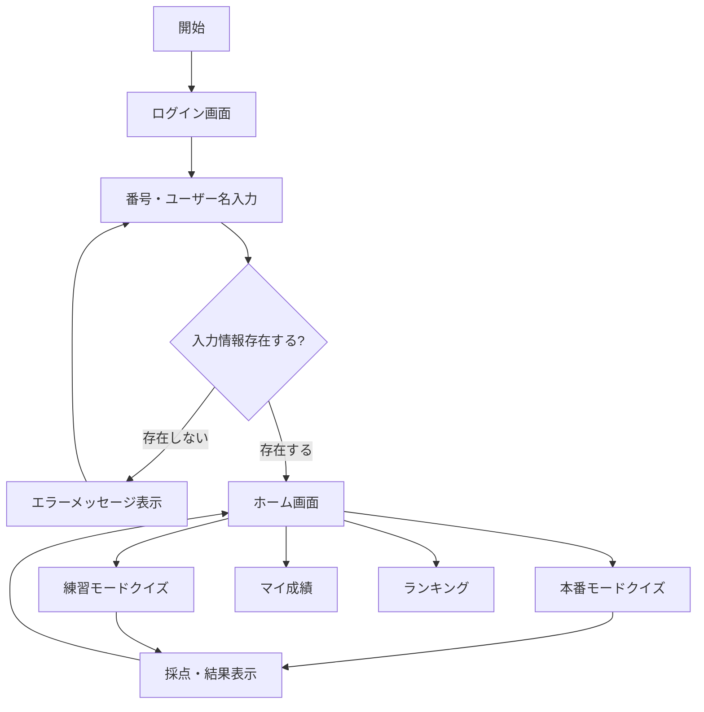

# 実装したい機能

## 概要
[ここに機能の概要を記述]
# 要件定義

| 項目 | 内容 |
| --- | --- |
| ニーズ
（問題/課題) |  |
| 目的（定性） | **1. 前提・目的**
• [事実] 目的：新人（カラコン未経験）の店舗バイトを短期間で接客できるレベルに引き上げるための学習ツール。
• [事実] 新店舗オープンが10月に迫っている → フェーズ1を優先実装する必要あり。
• [推論] 早期導入で接客品質の底上げと、学習モチベーション向上（表彰・ランキング）を狙う。
• キーメッセージ：短時間で反復学習（視覚＋言語）→ 記憶定着 → 接客で即活用。 |
| 目標（定量） | 最短で最小構成のフェーズ1仕様でアプリを提出。その後フェーズ2へ移行。 |
| 制約条件 | **📱 最小構成での実装内容
Phase 1（〜9月末）：コア機能のみ**
**必須機能（70時間）**
1. 簡易ログイン（ID/パスワード）
2. 10問クイズ（1日1回）
3. 練習モード（無制限）
4. TOPへ戻るボタン（条件付き表示）
5. 簡易ダッシュボード（個人成績のみ）
6. 月間ランキング（自主練回数表示付き）
**データ連携（20時間）**
• Google Sheets読み込み
• 回答ログ保存
• 画像URL参照
**テスト（10時間）**
• 動作確認
• バグ修正

**Phase 2（10月以降）：追加機能**
• 管理者ダッシュボード
• CSV出力
• 高難易度クイズ（装用画像）
• デザイン改善

**🔧 技術選定（予算内実装）**
// 最小構成での技術スタック
const techStack = {
frontend: "HTML + CSS + Vanilla JS", // フレームワーク不使用
backend: "Google Apps Script", // 無料
database: "Google Sheets", // 既存利用
hosting: "GAS Web App", // 無料
images: "GitHub (Figma plugin export)", // 既存利用
};
// 工数削減のポイント
const costSaving = {
"UIフレームワーク不使用": "▲15時間",
"認証簡略化": "▲10時間",
"デザイン最小限": "▲20時間",
"管理機能後回し": "▲15時間"
};

**📊 Google Sheets構成（最小限）
1. ユーザーマスター**
user_id | name | password | store | role
staff001 | さくら | 1234 | 渋谷店 | staff
**2. 商品マスター（既存流用）**
product_id | brand | series | color | image_url | comment
**3. 回答ログ**
timestamp | user_id | mode | question_no | correct | time_taken
**4. 月間集計**
user_id | correct_rate | total_points | practice_count | rank |
| **対象ユーザー** | 非IT、非エンジニア人材が多数の割合を占める。
• 新人アルバイト（若年層・女性が中心）
• 店長／上長（管理者ダッシュボードで全員の成績閲覧）
• システム運用者（スプレッドシート/GAS管理）
•フェーズ2から本社の社員利用も視野に入れる |
| 概要 | **3. 概要（高レベル）**
• Webアプリ（スマホ最適化）に各バイトごとのアカウントを発行。
• 毎日ランダムに「10問のカラコン名称当てクイズ」を出題（本番モード：日1回、練習モード：無制限）。
• 正答データをスプレッドシートへ保存し、GASで集計 → ダッシュボード化（個人推移、週間/月間ランキング、未正解アイテム）。
• 出題データは既存スプレッドシート（109販促データ）内にある商品情報と、Driveの画像URLを参照してリアルタイムに生成。
• デザイン：若年女性に響く「ポップ」なUI。店舗イメージも反映。 |
| 優先度 | **. フェーズ分け（優先度）**

**フェーズ1（必須／10月以内に対応）**
• ユーザー認証（アカウント発行、ログイン）
• 本番モード：1日1回・10問（四択）出題、制限時間、即時答え合わせ（正誤・正解表示・簡潔な商品ポイント）
• 練習モード：無制限で同様の形式（リトライ可）
• 結果保存：回答ログ（誰が、いつ、何問正解/不正解、当てられなかった商品ID）→ Google Spreadsheet
• ダッシュボード（GAS + スプレッドシート / シンプルな可視化）
• スプレッドシート読み込み：商品一覧＋Drive画像URL（既存シート参照）
• スマホ最適化レスポンシブUI

**フェーズ2（優先度高）**
• 四択以外の問題タイプ（テキスト自由入力／複数必須入力）
• 詳細スコアリング（必須項目3点、任意項目1点等）
• 各設問ごとのフィードバック（「見分け方のヒント」「接客一言」）を充実
• 月間自動ランキング＆表彰メール通知
**フェーズ3（将来的）**
• 勤怠データや出勤情報との連携（Notion / 勤怠ソフト）
• 画像ベースでの類似判定（視覚的学習支援）
• 管理者向けの高度な分析（学習曲線／問題難易度分析） |
| **機能要件（細分化）**
 | **5. 機能要件（細分化）

A. 認証・アカウント**
• アカウント種別：ユーザー（バイト）／上長（管理者）
• 各ユーザーに固有のログインID・パスワード（メールアドレス or 社内ID）
• 権限：ユーザーは自分の成績のみ閲覧、上長は全員の成績閲覧

**B. クイズ機能**
•カラコンレンズ画像が表示されるので、制限時間以内に表示される4択の商品名の中から正しい商品名を選択、回答。10問中の正答率（◯◯%）で結果発表。
• 出題数：10問／回
• モード：本番（1日1回）／練習（無制限）
• 形式（初版）：A. 四択（必須）
• 各設問のUI：問題番号／左右にレンズ画像（両目）／選択肢（4つ）／制限時間カウントダウン／ヒント1／ヒント2
• 回答結果：即時に正誤表示、正解の名称表示、簡潔な商品ワンポイント（接客用一言）
• リセット機能：誤アカウントで入った場合のリセット（1回のみ許容）
****•ヒント1はSPECを表示：DIA/G.DIA/B.C/含水率
•ヒント2はコメントを表示
•正解、不正解時には専用演出
•正解発表画面：サムネ画像/左右にレンズ画像（両目）/SPECのDIA/G.DIA/B.C/含水率/コメント
**を表示**
•**問題は全問共通：「このカラコンの名前は?」表示される四択の中に正解は一つ。この四択は正解以外はランダムに抽出。正解と同系統のカラーを抽出するようにする

C. データ収集・保存**
• 保存先：Google Spreadsheet（既存シートを利用）
• 保存項目（回答ログ）例：timestamp, user_id, mode(本番/練習), question_no, product_id, chosen_option, correct_flag, time_taken, optional_inputs（DIAなど）, image_url

**D. ランダム出題ロジック**
• 既存スプレッドシートからランダム抽出（対象カラムを参照）
• 重複出題回避（当日中は同一ユーザーに同一商品を出題しない等）

**E. ダッシュボード（管理者・個人）**
• 個人成績ページ：過去の成績推移（グラフ）、未正解一覧、学習傾向
• 管理者ページ：全ユーザーの順位・月間正答率・週間上位者リスト・未正解多数の商品一覧（教育優先度高）
• 表彰ロジック：月間総合正答率ランキング（上位N名を表示／CSV出力）

**F. コンテンツ管理**
• 問題用データ（商品名・ブランド・カラー名・画像URL・接客一言等）はスプレッドシートで編集可能にしておく（運用性重視）

**G. デザイン要件**
• 若年女性向けのポップで親しみやすい配色・アイコン
• 画像中心のレイアウト、フォントは読みやすい丸ゴシック推奨
• 店舗名や店舗画像でブランディングできるヘッダー

**H. 非機能要件**
• モバイルファースト（レスポンシブ）
• ロード時間短縮（画像はDriveの圧縮サムネ使用）
• アクセシビリティ（色だけで正誤を伝えない）
• セキュリティ：Googleアカウント連携 or 独自認証（要検討） |
| **6. データモデル（スプレッドシート：推奨スキーマ）**
 | **6. データモデル（スプレッドシート：推奨スキーマ）

商品マスター（既存シートを拡張）**
• 品番 (product_id)
• ブランド名 (brand)
• シリーズ名 (series)
• カラー名（カナ）(color_kana)
• カラー名（表記）(color_label)
• 装用期間 (wear_period)
• DIA (dia)
• G.DIA (g_dia)
• BC (bc)
• レンズ機能 (lens_feature)
• サムネマスター (thumbnail_master)
• 着用画像(黒目) (img_black)
• 着用画像(茶目) (img_brown)
• レンズ画像（両目） (img_lens) ← Drive URL（AF列相当）
• 接客ワンフレーズ (sales_pitch) ← 簡潔に1行

**回答ログ**
• timestamp
• user_id
• user_name
• mode (production/practice)
• attempt_no (当日カウント)
• question_index (1〜10)
• product_id
• option_selected
• correct_flag (true/false)
• time_taken_sec
• optional_inputs (json：DIA/着色直径/BC等)
• image_url

**ユーザーマスター**
• user_id
• name
• role (staff/manager)
• store_id
• join_date |
| **UIフロー（ユーザー視点：簡潔）**
 | **7. UIフロー（ユーザー視点：簡潔）**
1. ログイン（ID/PW）
2. ホーム（本日のテスト：○○さんはまだ未実施 or 実施済み）
3. 本番テスト開始 → 10問連続出題（各問：画像＋選択肢＋カウントダウン）
4. 全問終了 → 結果画面（得点・正誤・接客ワンフレーズ・間違いリスト）
5. 個人成績ページ（過去の推移、学習ヒント）
6. 練習モードは同様だが「実力測定」には反映しない（ただしログは残す）
7.ランキング |
| **ビジネスルール／採点ルール**
 | **8. ビジネスルール／採点ルール**
• 四択：1問 = 1ポイント
• 将来的なテキスト入力形式：ブランド/シリーズ/カラー（必須3項目） = 各3ポイント（表記の揺れは読み仮名ベースで正誤判定）
• 任意項目（DIA, 着色直径, BC） = 各1ポイント（入力が正確なら加点）
• 本番モードは1日1回のみ加点対象。練習モードはスコアに影響しないが学習ログとして蓄積。
• リセット機能：誤ったアカウントでログインした場合に、運用者（又は本人1回）でテストをリトライ可能（詳細は運用ポリシー） |
|  | **9. ダッシュボード要件（管理者）**
• KPI（表示）：日別正答率、週間上位者、月間ランキング、未正解商品ランキング（教育優先）
• フィルタ：日付範囲／店舗／ユーザー名
• データ出力：CSVダウンロード、メール通知（月末）
• 実装案（短期）：Google Spreadsheet + Google Data Studio（Looker Studio） or GASで自動集計＋シンプルなHTML出力 |
|  | **10. 技術的実装メモ（非エンジニア向け簡潔説明）**
• 画像・商品情報の取得：既存スプレッドシートのDrive URLを参照してアプリ側で画像を読み込み。

    ◦ [推論] Drive公開設定に注意（アプリが画像を読むには共有設定が必要）。
• Webアプリ案：Google Apps Script（GAS） + HTML/CSS/JS（初心者向け、Google環境で完結） or Firebase Hosting + Firestore（拡張性高）

    ◦ [推論] 10月の納期を考えると、**GAS + スプレッドシート（初期）**が最も短工数で実現可能。
• 集計：GASでスプレッドシートにログを書き、定期実行で集計・ランキングを生成→LookerStudioに繋げると非エンジニアでも見るのが楽。
• 認証：GASでGoogleアカウント連携 or 簡易パスワード管理（運用体制に合わせて推奨） |
|  | **11. 運用ルール（提案）**
• コンテンツ更新：商品マスターの更新は管理者（1〜2名）に権限を限定。
• 毎週の振り返り：週次で未正解上位商品をピックアップし、ミニ勉強会で共有。
• 表彰：月間ランキング上位者は店内ボードで表彰（モチベーション喚起） |
|  | **12. 受け入れ基準（フェーズ1）**
• 各ユーザーがログインでき、1日1回の本番テストが動作すること。
• 10問のランダム出題・制限時間・即時採点が正しく行われること。
• 回答ログがスプレッドシートに保存され、GASで日次の集計ができること。
• 管理者用ダッシュボードで個人の当日スコア・週間ランキング・未正解一覧が確認できること。
• スマホで表示崩れがない（主要端末でチェック済み）。 |
| **13. リスク & 懸念（要対応）**
 | • 画像のDrive共有設定が適切でないと画像読み込み失敗（対策：画像一覧を別途アップロードしてURL検証）。
• 表記揺れ（カナ/英字/全角半角）による自由入力判定の難しさ（対策：読み仮名ベースの正規化／同義語マッピング）。
• 本番モードの不正（複数アカウントでの回数稼ぎ等）→ IP/端末制限や運用ルールで対応。
• スケーラビリティ（将来ユーザー数増加時）：初期はGAS可、長期はFirestore等への移行を検討。
**** |
| **14. 次のアクション（短期：推奨）** | **14. 次のアクション（短期：推奨）**
1. **優先決定（ユーザー）**：フェーズ1で良いか確定する（→10月対応可否）。[すでにフェーズ1希望なら次へ]
2. **運用データ確認（作業）**：既存スプレッドシート（リンク提供済）で、画像URLが有効か検証。
3. **技術選定（提案）**：GASベースのPoCを提案（見積り＋工数：要確認）［私の推奨：短納期かつGoogle環境で完結］。
4. **ワイヤーフレーム作成**：ホーム→テスト→結果→ダッシュボード（スマホ優先）。簡易モックを1〜2日で作成可能。
5. **開発＆検証**：PoCを社内で回してフィードバック→本開発。
[推論] 画像URLや商品データの整備状況次第でPoCの着手が早くなります。まず「画像URLの有効性チェック」を優先してください。 |
| **15. 付録：短いチェックリスト（すぐやること）**
 | • 既存スプレッドシートの画像URLをランダム10件で動作確認する。
• 管理者とユーザーのIDリスト（テストアカウント含む）を用意する。
• 接客ワンフレーズ（sales_pitch）を商品マスターに追記（最初は簡易でOK）。
• PoC用のUIモック（スマホ1ページ）を承認。
**16. 表記：事実／推論／仮説の注記**
• 本ドキュメント中で **[事実]** はユーザー提供の情報に基づく（例：スプレッドシートのリンク、10月オープン等）。
• **[推論]** は納期・実装方式の現実性に関する私の合理的な判断（例：GASが短期で実現可能）。
• **[仮説]**（該当箇所があれば）については、実データ確認後に確定する必要があります（例：画像の公開設定が正しいか等）。 |
| デザイン要件 |  |
|  |  |
## 詳細
[複数行で詳細な要件を記述できます]
# ホテラバカラコンアカデミア 仕様書 v3.3（統合版）

作成日時: 2025年10月20日 2:38
DB_yy_ジャンル_プロパティ: 案件資料 (https://www.notion.so/26479d7c676a8052b4aaf6fed6f1e26a?pvs=21), 保存版 (https://www.notion.so/22579d7c676a81d8be19cdf9cafcb954?pvs=21), エンジニアリング (https://www.notion.so/22579d7c676a8130b21cd97d4bb3da6f?pvs=21)
DB_取引先データベース (1): 株式会社ホテラバ (https://www.notion.so/22579d7c676a81bcbbe7ee3033578e9d?pvs=21)
DB_プロジェクト管理_PJ管理ツール💎: HL001_オンボーディング用カラコンクイズアプリ開発 (https://www.notion.so/HL001_-26779d7c676a8076953cceebe3d361a7?pvs=21)
メモ確認済み: No

プロジェクトファイルを確認して、仕様書v3.3を作成させていただきます。まず、添付ファイルを読み込んで内容を確認いたします。添付されているExcelファイルの内容を確認します。プロジェクト知識から、仕様書の最新版（v3.2）の内容を読み込んで、記載項目の整合性を確認して、仕様書v3.3を作成いたします。これまでの仕様書v3.0、v3.1、v3.2と各種ドキュメントの内容を読み込みました。統合された仕様書v3.3を作成いたします。

# ホテラバカラコンアカデミア 仕様書 v3.3（統合版）

作成日: 2025-10-20

基準：v3.0をベースに、v3.1とv3.2の更新内容を統合し、整合性を確保

---

## 0. 変更履歴サマリ

### v3.0 → v3.1の変更

- スコア計算を「正答率(最大100) + ヒント(最大50) + タイム(最大50)」に統一（合計200点満点）
- EXP/RP付与ロジックの実装（本番でstreakブースト、練習は控えめ）
- レベル曲線を非線形（Lv^1.5 * 100の逐次和）で算出、上限30
- 称号をTITLESシートで外部管理
- ランキングをweekly/monthly/yearlyの縦連結で出力（dailyは出力対象外）
- マイ成績に内訳表示と直近EXP/RP合計・棒グラフを追加
- 結果画面後のループ不具合修正（finishedフラグ、タイマー確実停止）

### v3.1 → v3.2の変更

- UI刷新（Figma 430×817px基準、SP最優先）
- 背景レイヤーシステム導入（背景画像/ぼかし/コンテンツ分離）
- 画像取得と設定管理の強化（getUiBase拡張、Script Properties UI_BASE_URL）
- ホーム画面再設計（プロフィールカード、ステータスピル、2×2ボタングリッド）
- 運用/デプロイフローの整理（hotfixブランチ、PR運用）

### v3.2 → v3.3の整合性確保

- 「クイズの基本ルール」の内容を正式仕様として統合
- 連続正解ボーナス（最大30点）の追加明記
- 早解きボーナス（最大20点）の詳細化
- USERSシート更新ロジックの完全記載
- E_I_J_K完全一致でのランキングロジックの統合（将来実装予定）

---

## 1. アプリ概要

| 項目 | 内容 |
| --- | --- |
| 名称 | ホテラバカラコンアカデミア（Hotel Baccarat × 学習クイズアプリ） |
| 利用者 | ホテラバカラコン従業員＋アカデミア受講者 |
| 目的 | カラコンを見ただけで種類を理解し、ゲーミフィケーションを通じて商品知識の向上を促す |
| 提供機能 | カラコン識別クイズ、本番/練習モード、ランキング、マイ成績、管理者分析 |
| フロントエンド | Google Apps Script HTML Service（index.html等） |
| バックエンド | Google Apps Script（*.gs, *.js）、GAS API経由で各シートを参照/更新 |
| データ格納 | Google Sheets（USERS, HISTORY, TITLES, RANKINGS等） |

---

## 2. 画面遷移フロー



---

## 3. クイズ仕様

### 3.1 基本設定

| 項目 | 仕様 | 備考 |
| --- | --- | --- |
| 出題数 | 10問固定 | 1セッション |
| 形式 | 4択クイズ | 各問題 |
| 制限時間 | 20秒/問 | 最大回答時間200秒 |
| 出題対象 | データ完備商品のみ | CYL（乱視用）は除外 |
| 画像表示 | レンズ画像を左右2枚 | 同一画像 |

### 3.2 ヒント機能

| ヒント種別 | 内容 | ボーナスへの影響 |
| --- | --- | --- |
| ヒント1 | カラコンSPEC（DIA/G.DIA/BC） | 使用で減点 |
| ヒント2 | PRする際の一言コメント | 使用で減点 |

**注：** ヒントは自由意志で使用可能。最大20個（10問×2種）

### 3.3 スコア計算（最大200点）

| 項目 | 計算方法 | 最大値 | 条件 |
| --- | --- | --- | --- |
| **正答率** | 正解数 × 10 | 100点 | 最重要指標 |
| **ヒントボーナス** | 下記参照 | 50点 | 正解時のみ加算 |
| **タイムボーナス** | 余り秒合計 ÷ 4 | 50点 | 正解時のみ加算 |
| **合計** | accuracy + hintBonus + timeBonus | 200点 | - |

### ヒントボーナス詳細（正解時のみ）

- ヒント未使用：+5点
- ヒント1のみ使用：+2点
- ヒント2も使用：+0点

### タイムボーナス詳細（正解時のみ）

- 余り秒 = (20 - timeSpent)
- 全問の余り秒合計を4で割って丸め（最大200秒 → 50点）

### 追加ボーナス（将来実装検討）

- **連続正解ボーナス**（最大30点）
    - 2〜3問連続：5点
    - 4〜5問連続：10点
    - 6〜7問連続：15点
    - 8〜9問連続：20点
    - 10問連続：30点
- **早解きボーナス**（最大20点）
    - 回答時間が短いほど高得点

**注：** 誤答時はヒントボーナス・タイムボーナス共に0点

---

## 4. モードとstreak管理

### 4.1 モード種別

| モード | mode値 | 制限 | EXP獲得 | RP獲得 | streak更新 |
| --- | --- | --- | --- | --- | --- |
| 本番（デイリーテスト） | daily | 1日1回 | totalScore × ブースト | totalScore | あり |
| 練習 | practice | 無制限 | round(accuracy/10)最大10 | 0 | なし |

### 4.2 streak（連続日）管理

- **基準**：USERS.I:lastDailyDateで管理
- **更新ロジック**：
    - 同日：streak維持
    - 翌日：streak + 1
    - 2日以上空き：1にリセット

### 4.3 streakボーナス（本番モードのみ）

| 連続日数 | ブースト倍率 |
| --- | --- |
| 1日目 | 1.0倍 |
| 2日目 | 1.1倍 |
| 3日目 | 1.2倍 |
| 4日目 | 1.3倍 |
| 5日目 | 1.4倍 |
| 6日目 | 1.5倍 |
| 7日目以降 | 1.5倍（上限） |

---

## 5. EXP/RP/レベルシステム

### 5.1 ポイントの種類

| 種類 | 名称 | 役割 | 特徴 |
| --- | --- | --- | --- |
| 累計EXP | 経験値 | レベルアップ用 | 永続的、消えない |
| RP | ランクポイント | ランキング用 | 期間限定、リセットあり |

### 5.2 レベル曲線（上限30）

**計算式：** req[Lv] = req[Lv-1] + round((Lv-1)^1.5 × 100)

| レベル | 必要累計EXP（例） | 増分 |
| --- | --- | --- |
| 1→2 | 200 | 200 |
| 2→3 | 450 | 250 |
| 3→4 | 750 | 300 |
| 9→10 | 4,000 | - |
| 19→20 | 15,000 | - |
| 29→30 | 35,000 | - |

**注：** 最短118日（約4ヶ月）でレベル30到達可能

### 5.3 称号システム（TITLESシート管理）

| レベル範囲 | 称号 |
| --- | --- |
| 1 | カラコンルーキー |
| 5 | レンズエキスパート |
| 10 | カラーマイスター |
| 20 | マスターオブコンタクト |
| 30 | 伝説のカラコンクイーン/伝説の瞳 |

---

## 6. データ構造

### 6.1 HISTORYシート（v11形式：1回答=1行）

| 列 | 項目 | 説明 |
| --- | --- | --- |
| A | historyId | 一意ID |
| B | timestamp | 回答日時 |
| C | userId | スタッフ番号 |
| D | mode | daily/practice |
| E | questionId | 問題ID |
| G | isCorrect | 正解フラグ |
| H | hintsUsed | ヒント使用数 |
| I | timeSpent | 回答時間（秒） |
| J | score | 行スコア |
| K | totalScore | セッション合計 |
| L | metadata | JSON（下記参照） |

### metadata内容

```json
{
  "accuracy": 80,
  "hintBonus": 30,
  "timeBonus": 25,
  "correctCount": 8,
  "expEarned": 95,
  "rpEarned": 80,
  "streakAfter": 5,
  "boost": 1.3,
  "levelAfter": 12,
  "pointsAfter": 1850
}

```

### 6.2 USERSシート

| 列 | 項目 | 説明 | 実装状況 |
| --- | --- | --- | --- |
| A | userId | スタッフ番号 | 実装済み |
| B | name | ユーザー名 | 実装済み |
| C | store | 所属店舗 | 実装済み |
| D | level | レベル（1-30） | 実装済み |
| E | points | 累計EXP | 実装済み |
| F | streak | 連続日数 | 実装済み |
| G | totalPractice | 練習回数 | 実装済み |
| H | totalDaily | 本番回数 | 実装済み |
| I | lastDailyDate | 最終本番日 | 実装済み |
| J | role | 権限 | 未実装 |
| K | hire_date | 入社日 | 未実装 |

### 6.3 RANKINGSシート

| 列 | 項目 | 説明 |
| --- | --- | --- |
| A | userId | スタッフ番号 |
| B | userName | ユーザー名 |
| C | store | 所属店舗 |
| D | bestTotalScore | ベストスコア |
| E | bestAccuracy | ベスト正答率 |
| F | bestBonusPoints | ベストヒントボーナス |
| G | bestTimeBonus | ベストタイムボーナス |
| H | totalPractice | 練習回数 |
| I | totalDaily | 本番回数 |
| J | lastPlayed | 最終プレイ日 |
| scope | scope | weekly/monthly/yearly |

---

## 7. ランキング仕様

### 7.1 集計単位と期間

| scope | 期間 | 出力対象 | 画面表示 |
| --- | --- | --- | --- |
| daily | 当日 | × | タブ非表示検討 |
| weekly | ISO週 | ○ | 初期選択 |
| monthly | 月単位 | ○ | ○ |
| yearly | 年単位 | ○ | ○ |

### 7.2 ソート優先順位

1. bestTotalScore（降順）
2. bestAccuracy（降順）
3. totalDaily + totalPractice（降順）
4. lastPlayed（降順）

### 7.3 掲載条件

- attempts >= 3（期間内3回以上挑戦）

---

## 8. マイ成績仕様

### 8.1 表示内容

- **直近10セッション**の詳細
    - 日付とモード（本番/練習）
    - 内訳：正答率/ヒント/タイム/EXP/RP
    - 合計スコアと正答率
- **サマリー情報**
    - 直近EXP/RP合計
    - 棒グラフ（EXP/RP推移）

### 8.2 将来改善案

- フィルタ機能（本番のみ/練習のみ）
- 期間選択
- Chart.jsへの置換

---

## 9. UI仕様（v3.2で刷新）

### 9.1 基本設計

- **基準サイズ**：430×817px（Figma準拠）
- **対応**：SP最優先、transform:scaleで画面適応
- **背景システム**：3層レイヤー構造

### 9.2 背景レイヤーシステム

| レイヤー | クラス名 | 役割 |
| --- | --- | --- |
| 最背面 | .bg-layer-bottom | 背景画像（fixed, cover） |
| 中間 | .bg-layer-blur | radial blur効果 |
| 最前面 | .content-layer | コンテンツ |
| 完了時 | body.bg-ready | オーバーレイ無効化 |

### 9.3 画面別仕様

### ログイン画面

| 要素 | 位置(x,y) | サイズ(w,h) | 備考 |
| --- | --- | --- | --- |
| ロゴ | (16,160) | 392×242 | CSS変数管理 |
| 入力カード | (57,383) | 315×min165 | Glass風 |
| ログインボタン | (42,580) | 346×128 | 画像+テキスト |

### ホーム画面

| 要素 | 位置(x,y) | サイズ | 備考 |
| --- | --- | --- | --- |
| プロフィール | (27,37) | 373×108 | アバター100px |
| ステータスピル | (43,152) | 341×76 | 3分割表示 |
| メニューグリッド | (35,249) | 410×227×2 | 2×2ボタン |
| フッター | (10,710) | 146×46×2 | ログアウト/HELP |

### 9.4 画像アセット

| 画像ファイル | 用途 | 管理 |
| --- | --- | --- |
| haikei1.png | ログイン背景 | UI_BASE経由 |
| haikei2.png | ホーム背景 | UI_BASE経由 |
| roginbtn.png | ログインボタン | - |
| btn-daily/practice/ranking/stats.png | メニューボタン | テキストなし版推奨 |
| logoutbtn/helpbtn.png | フッターボタン | hotfix済み |

---

## 10. GAS関数仕様

### 10.1 主要関数一覧

| 関数名 | 説明 | 備考 |
| --- | --- | --- |
| getUiBase() | UI画像ベースURL取得 | UI_BASE_URL優先 |
| setUiBaseUrl(url) | Script Property設定 | 環境切替用 |
| submitQuizAnswers(payload) | 履歴保存+EXP/RP計算 | metadata保存 |
| awardExperienceAndRank() | USERS更新 | streak/称号含む |
| getRanking(scope) | ランキング取得 | on-demand集計 |
| updateRankingsAllScopes() | ランキング生成 | 縦連結保存 |
| getMyStats(userId) | マイ成績取得 | 直近10セッション |
| getHomeData(userId) | ホーム画面データ | 称号付き |
| aggregateUserEffort() | USER_EFFORT_STATS更新 | 集計処理 |

### 10.2 設定管理

- **CONFIG.SHEET_IDS**：シートID管理
- **Script Properties**：
    - UI_BASE_URL：画像ベースURL
    - その他環境変数
- **シート名探索順序**：
    - HISTORYシート：history → HISTORY → quiz_history → QUIZ_HISTORY

---

## 11. デプロイ・運用

### 11.1 デプロイ手順

```powershell
# PowerShellで実行
cd C:\Users\seran\Documents\OneDrive\デスクトップ\001Devlopment\HL001-quiz
clasp push
clasp version "仕様v3.3対応"
clasp deploy -i AKfycbw_pqYq6-ckNmiN9cGa6-XFg_3ZURAOZ0EfghWIu_ukFHCH7TpQXqKOfbOyzWZMnmuB8A -d "v3.3デプロイ"

```

### 11.2 ブランチ戦略

| ブランチ | 用途 |
| --- | --- |
| main | 本番環境 |
| feature/ui-login | UI開発 |
| hotfix/ui-images-to-main | 画像のみ先行反映 |

### 11.3 運用メモ

- TITLESシート不在時：`ensureDefaultTitlesSheet()`実行
- 仕様変更時：HISTORY metadataキー追加で後方互換維持
- ランキング更新：保存時自動更新（夜間トリガー併用可）
- PowerShellとCLI認証は別管理

---

## 12. 既知の課題と今後の検討事項

### 12.1 実装済み機能

✅ スコア計算（200点満点）

✅ EXP/RP付与ロジック

✅ streakブースト

✅ レベル曲線（Lv^1.5）

✅ 称号システム（TITLES）

✅ ランキング（週/月/年）

✅ マイ成績（内訳表示）

✅ UI刷新（Figma準拠）

✅ バグ修正（ループ、重複送信）

### 12.2 未実装・検討中

| 分類 | 内容 | 優先度 |
| --- | --- | --- |
| UI | ボタン画像からテキスト分離 | 中 |
| 機能 | 連続正解ボーナス実装 | 高 |
| 機能 | 早解きボーナス実装 | 中 |
| 機能 | E_I_J_K完全一致ランキング | 低 |
| 分析 | 管理者ダッシュボード | 高 |
| ランキング | dailyタブ整理 | 低 |
| ランキング | tie-breaker明文化 | 中 |
| グラフ | Chart.js導入 | 中 |
| テスト | 自動テスト導入 | 高 |
| 運用 | CI/CD整備 | 中 |

---

## 13. API仕様

### 13.1 エンドポイント一覧

| メソッド | エンドポイント | 説明 | 実装状況 |
| --- | --- | --- | --- |
| GET | getQuizQuestions | 10問取得 | 実装済み |
| POST | submitQuizAnswers | 回答送信・保存 | 実装済み |
| GET | getRanking | ランキング取得 | 実装済み |
| GET | getMyStats | マイ成績取得 | 実装済み |
| GET | getHomeData | ホームデータ取得 | 実装済み |
| POST | authenticateUser | ユーザー認証 | 実装済み |

### 13.2 レスポンス例（getMyStats）

```json
{
  "userId": "USER001",
  "name": "さくらちゃん",
  "store": "渋谷店",
  "summary": {
    "totalPlayed": 15,
    "totalPoints": 1275,
    "avgPoints": 85,
    "recentExp": 450,
    "recentRp": 380
  },
  "recent10": [
    {
      "date": "2025-10-06",
      "mode": "daily",
      "score": 185,
      "accuracy": 90,
      "hintBonus": 45,
      "timeBonus": 50,
      "expEarned": 278,
      "rpEarned": 185
    }
  ]
}

```

---

## 付録A：参照ドキュメント

- v3.0 仕様書（基本仕様）
- v3.1 差分付き仕様書（スコア/EXP/RP改定）
- v3.2 仕様書（UI刷新）
- クイズの基本ルール.md
- usersシートのlevel/points/streak更新ロジック.md
- E_I_J_K完全一致でのランキング&マイ成績ロジック.md

## 付録B：重要ファイル

| 種別 | パス | 備考 |
| --- | --- | --- |
| メインHTML | HL001-quiz/index.html | 全画面統合 |
| 設定 | 0_config.gs | CONFIG定義 |
| 履歴API | HistoryAPI.gs | 保存・集計 |
| 集計 | DashboardAggregation.gs | 管理用集計 |
| UI画像 | images/UI/ | UI_BASE経由 |
| 管理画面 | admin-dashboard.html | 雛形のみ |

---

**以上が仕様書v3.3です。v3.0の基本構成を維持しつつ、v3.1のゲーミフィケーション強化とv3.2のUI刷新を統合し、整合性を確保しました。**
## Figmaエクスポートフロー
- Figma 430x817px 基準で作成したフレームをプラグインでエクスポートし、layout.json と PNG を同じ imageId (`global_screen_*`) でそろえる。
- Zip には layout.json と PNG を同梱し、出力完了時に UI で `codex ui-assets sync ./exports/<layout>.zip` を案内する。
- Codex/CloudCode は上記コマンドを受けると Zip を GitHub の `HL001-quiz/images/` 配下へ push し、GAS までデプロイする。
- ユーザーは最終確認のみを行い、ズレがあれば Figma -> 再エクスポート -> 同コマンドで再同期する。

## �Z�N�V����3�̎��s���
### ���s
- index.html 647�Ŋ��� AppState �ƃN�C�Y�X�e�[�g�̑����@typedef �Ń^�O�Z�b�g���A���ׂẴA�v���̉����e�X�g���w���悤�ɂ���B
- createQuizState() ��O���Ă��A�V�K�����ł�AppState.quiz��quizState��قȂ邽�߂�startQuiz()��init���̏ꏊ�ŊJ�n�񐔂�����B(index.html:791)
- �u���O�C���R�[�h�ł݂̂ꂪ�ł���currentUser�̌^�B�ʂĐ����ł����悤�ɁA�ڕW�̊������ƂȂ�AppState.user��login/utoLogin/getHomeData/logout�ȊO�񐔂Œǂݎ���悤�ɂ���B(index.html:684, 723, 761, 849)
- DOM���[�h�Ɠ����localStorage�����o�Ă������������AppState.user�ɏ㏑����A��������AppState�����̂܂܈��Ԃłł͂Ȃ��悤�ɂ���B(index.html:817)

### ����̃t�H�g�V��
- �����̃N�C�Y�AUI���W�b�N�ł��AppState����������A�^�X�N1.1�̌��ɂ����悤�ɂ���B
- Question/Response payload �ƃo���f�[�V��������������邽�߁AAppState���g�p���A�����g��Sheets layer���]�炵�Ă���2�̑I����ւ����߂�B

### �e�X�g
- ���s���Ă��܂���B
