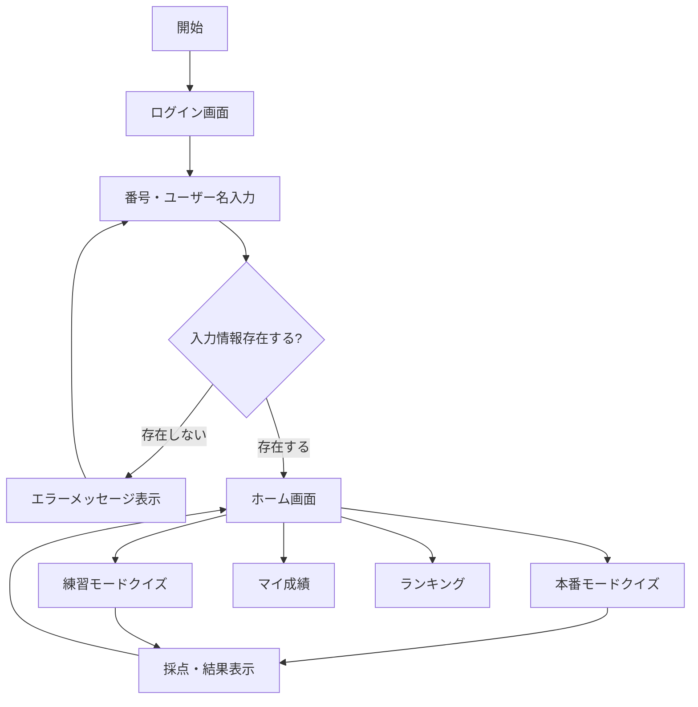

# ホテラバカラコンアカデミア 仕様書 v3.3（統合版）

作成日時: 2025年10月20日 2:38
DB_yy_ジャンル_プロパティ: 案件資料 (https://www.notion.so/26479d7c676a8052b4aaf6fed6f1e26a?pvs=21), 保存版 (https://www.notion.so/22579d7c676a81d8be19cdf9cafcb954?pvs=21), エンジニアリング (https://www.notion.so/22579d7c676a8130b21cd97d4bb3da6f?pvs=21)
DB_取引先データベース (1): 株式会社ホテラバ (https://www.notion.so/22579d7c676a81bcbbe7ee3033578e9d?pvs=21)
DB_プロジェクト管理_PJ管理ツール💎: HL001_オンボーディング用カラコンクイズアプリ開発 (https://www.notion.so/HL001_-26779d7c676a8076953cceebe3d361a7?pvs=21)
メモ確認済み: No

プロジェクトファイルを確認して、仕様書v3.3を作成させていただきます。まず、添付ファイルを読み込んで内容を確認いたします。添付されているExcelファイルの内容を確認します。プロジェクト知識から、仕様書の最新版（v3.2）の内容を読み込んで、記載項目の整合性を確認して、仕様書v3.3を作成いたします。これまでの仕様書v3.0、v3.1、v3.2と各種ドキュメントの内容を読み込みました。統合された仕様書v3.3を作成いたします。

# ホテラバカラコンアカデミア 仕様書 v3.3（統合版）

作成日: 2025-10-20

基準：v3.0をベースに、v3.1とv3.2の更新内容を統合し、整合性を確保

---

## 0. 変更履歴サマリ

### v3.0 → v3.1の変更

- スコア計算を「正答率(最大100) + ヒント(最大50) + タイム(最大50)」に統一（合計200点満点）
- EXP/RP付与ロジックの実装（本番でstreakブースト、練習は控えめ）
- レベル曲線を非線形（Lv^1.5 * 100の逐次和）で算出、上限30
- 称号をTITLESシートで外部管理
- ランキングをweekly/monthly/yearlyの縦連結で出力（dailyは出力対象外）
- マイ成績に内訳表示と直近EXP/RP合計・棒グラフを追加
- 結果画面後のループ不具合修正（finishedフラグ、タイマー確実停止）

### v3.1 → v3.2の変更

- UI刷新（Figma 430×817px基準、SP最優先）
- 背景レイヤーシステム導入（背景画像/ぼかし/コンテンツ分離）
- 画像取得と設定管理の強化（getUiBase拡張、Script Properties UI_BASE_URL）
- ホーム画面再設計（プロフィールカード、ステータスピル、2×2ボタングリッド）
- 運用/デプロイフローの整理（hotfixブランチ、PR運用）

### v3.2 → v3.3の整合性確保

- 「クイズの基本ルール」の内容を正式仕様として統合
- 連続正解ボーナス（最大30点）の追加明記
- 早解きボーナス（最大20点）の詳細化
- USERSシート更新ロジックの完全記載
- E_I_J_K完全一致でのランキングロジックの統合（将来実装予定）

---

## 1. アプリ概要

| 項目 | 内容 |
| --- | --- |
| 名称 | ホテラバカラコンアカデミア（Hotel Baccarat × 学習クイズアプリ） |
| 利用者 | ホテラバカラコン従業員＋アカデミア受講者 |
| 目的 | カラコンを見ただけで種類を理解し、ゲーミフィケーションを通じて商品知識の向上を促す |
| 提供機能 | カラコン識別クイズ、本番/練習モード、ランキング、マイ成績、管理者分析 |
| フロントエンド | Google Apps Script HTML Service（index.html等） |
| バックエンド | Google Apps Script（*.gs, *.js）、GAS API経由で各シートを参照/更新 |
| データ格納 | Google Sheets（USERS, HISTORY, TITLES, RANKINGS等） |

---

## 2. 画面遷移フロー



---

## 3. クイズ仕様

### 3.1 基本設定

| 項目 | 仕様 | 備考 |
| --- | --- | --- |
| 出題数 | 10問固定 | 1セッション |
| 形式 | 4択クイズ | 各問題 |
| 制限時間 | 20秒/問 | 最大回答時間200秒 |
| 出題対象 | データ完備商品のみ | CYL（乱視用）は除外 |
| 画像表示 | レンズ画像を左右2枚 | 同一画像 |

### 3.2 ヒント機能

| ヒント種別 | 内容 | ボーナスへの影響 |
| --- | --- | --- |
| ヒント1 | カラコンSPEC（DIA/G.DIA/BC） | 使用で減点 |
| ヒント2 | PRする際の一言コメント | 使用で減点 |

**注：** ヒントは自由意志で使用可能。最大20個（10問×2種）

### 3.3 スコア計算（最大200点）

| 項目 | 計算方法 | 最大値 | 条件 |
| --- | --- | --- | --- |
| **正答率** | 正解数 × 10 | 100点 | 最重要指標 |
| **ヒントボーナス** | 下記参照 | 50点 | 正解時のみ加算 |
| **タイムボーナス** | 余り秒合計 ÷ 4 | 50点 | 正解時のみ加算 |
| **合計** | accuracy + hintBonus + timeBonus | 200点 | - |

### ヒントボーナス詳細（正解時のみ）

- ヒント未使用：+5点
- ヒント1のみ使用：+2点
- ヒント2も使用：+0点

### タイムボーナス詳細（正解時のみ）

- 余り秒 = (20 - timeSpent)
- 全問の余り秒合計を4で割って丸め（最大200秒 → 50点）

### 追加ボーナス（将来実装検討）

- **連続正解ボーナス**（最大30点）
    - 2〜3問連続：5点
    - 4〜5問連続：10点
    - 6〜7問連続：15点
    - 8〜9問連続：20点
    - 10問連続：30点
- **早解きボーナス**（最大20点）
    - 回答時間が短いほど高得点

**注：** 誤答時はヒントボーナス・タイムボーナス共に0点

---

## 4. モードとstreak管理

### 4.1 モード種別

| モード | mode値 | 制限 | EXP獲得 | RP獲得 | streak更新 |
| --- | --- | --- | --- | --- | --- |
| 本番（デイリーテスト） | daily | 1日1回 | totalScore × ブースト | totalScore | あり |
| 練習 | practice | 無制限 | round(accuracy/10)最大10 | 0 | なし |

### 4.2 streak（連続日）管理

- **基準**：USERS.I:lastDailyDateで管理
- **更新ロジック**：
    - 同日：streak維持
    - 翌日：streak + 1
    - 2日以上空き：1にリセット

### 4.3 streakボーナス（本番モードのみ）

| 連続日数 | ブースト倍率 |
| --- | --- |
| 1日目 | 1.0倍 |
| 2日目 | 1.1倍 |
| 3日目 | 1.2倍 |
| 4日目 | 1.3倍 |
| 5日目 | 1.4倍 |
| 6日目 | 1.5倍 |
| 7日目以降 | 1.5倍（上限） |

---

## 5. EXP/RP/レベルシステム

### 5.1 ポイントの種類

| 種類 | 名称 | 役割 | 特徴 |
| --- | --- | --- | --- |
| 累計EXP | 経験値 | レベルアップ用 | 永続的、消えない |
| RP | ランクポイント | ランキング用 | 期間限定、リセットあり |

### 5.2 レベル曲線（上限30）

**計算式：** req[Lv] = req[Lv-1] + round((Lv-1)^1.5 × 100)

| レベル | 必要累計EXP（例） | 増分 |
| --- | --- | --- |
| 1→2 | 200 | 200 |
| 2→3 | 450 | 250 |
| 3→4 | 750 | 300 |
| 9→10 | 4,000 | - |
| 19→20 | 15,000 | - |
| 29→30 | 35,000 | - |

**注：** 最短118日（約4ヶ月）でレベル30到達可能

### 5.3 称号システム（TITLESシート管理）

| レベル範囲 | 称号 |
| --- | --- |
| 1 | カラコンルーキー |
| 5 | レンズエキスパート |
| 10 | カラーマイスター |
| 20 | マスターオブコンタクト |
| 30 | 伝説のカラコンクイーン/伝説の瞳 |

---

## 6. データ構造

### 6.1 HISTORYシート（v11形式：1回答=1行）

| 列 | 項目 | 説明 |
| --- | --- | --- |
| A | historyId | 一意ID |
| B | timestamp | 回答日時 |
| C | userId | スタッフ番号 |
| D | mode | daily/practice |
| E | questionId | 問題ID |
| G | isCorrect | 正解フラグ |
| H | hintsUsed | ヒント使用数 |
| I | timeSpent | 回答時間（秒） |
| J | score | 行スコア |
| K | totalScore | セッション合計 |
| L | metadata | JSON（下記参照） |

### metadata内容

```json
{
  "accuracy": 80,
  "hintBonus": 30,
  "timeBonus": 25,
  "correctCount": 8,
  "expEarned": 95,
  "rpEarned": 80,
  "streakAfter": 5,
  "boost": 1.3,
  "levelAfter": 12,
  "pointsAfter": 1850
}

```

### 6.2 USERSシート

| 列 | 項目 | 説明 | 実装状況 |
| --- | --- | --- | --- |
| A | userId | スタッフ番号 | 実装済み |
| B | name | ユーザー名 | 実装済み |
| C | store | 所属店舗 | 実装済み |
| D | level | レベル（1-30） | 実装済み |
| E | points | 累計EXP | 実装済み |
| F | streak | 連続日数 | 実装済み |
| G | totalPractice | 練習回数 | 実装済み |
| H | totalDaily | 本番回数 | 実装済み |
| I | lastDailyDate | 最終本番日 | 実装済み |
| J | role | 権限 | 未実装 |
| K | hire_date | 入社日 | 未実装 |

### 6.3 RANKINGSシート

| 列 | 項目 | 説明 |
| --- | --- | --- |
| A | userId | スタッフ番号 |
| B | userName | ユーザー名 |
| C | store | 所属店舗 |
| D | bestTotalScore | ベストスコア |
| E | bestAccuracy | ベスト正答率 |
| F | bestBonusPoints | ベストヒントボーナス |
| G | bestTimeBonus | ベストタイムボーナス |
| H | totalPractice | 練習回数 |
| I | totalDaily | 本番回数 |
| J | lastPlayed | 最終プレイ日 |
| scope | scope | weekly/monthly/yearly |

---

## 7. ランキング仕様

### 7.1 集計単位と期間

| scope | 期間 | 出力対象 | 画面表示 |
| --- | --- | --- | --- |
| daily | 当日 | × | タブ非表示検討 |
| weekly | ISO週 | ○ | 初期選択 |
| monthly | 月単位 | ○ | ○ |
| yearly | 年単位 | ○ | ○ |

### 7.2 ソート優先順位

1. bestTotalScore（降順）
2. bestAccuracy（降順）
3. totalDaily + totalPractice（降順）
4. lastPlayed（降順）

### 7.3 掲載条件

- attempts >= 3（期間内3回以上挑戦）

---

## 8. マイ成績仕様

### 8.1 表示内容

- **直近10セッション**の詳細
    - 日付とモード（本番/練習）
    - 内訳：正答率/ヒント/タイム/EXP/RP
    - 合計スコアと正答率
- **サマリー情報**
    - 直近EXP/RP合計
    - 棒グラフ（EXP/RP推移）

### 8.2 将来改善案

- フィルタ機能（本番のみ/練習のみ）
- 期間選択
- Chart.jsへの置換

---

## 9. UI仕様（v3.2で刷新）

### 9.1 基本設計

- **基準サイズ**：430×817px（Figma準拠）
- **対応**：SP最優先、transform:scaleで画面適応
- **背景システム**：3層レイヤー構造

### 9.2 背景レイヤーシステム

| レイヤー | クラス名 | 役割 |
| --- | --- | --- |
| 最背面 | .bg-layer-bottom | 背景画像（fixed, cover） |
| 中間 | .bg-layer-blur | radial blur効果 |
| 最前面 | .content-layer | コンテンツ |
| 完了時 | body.bg-ready | オーバーレイ無効化 |

### 9.3 画面別仕様

### ログイン画面

| 要素 | 位置(x,y) | サイズ(w,h) | 備考 |
| --- | --- | --- | --- |
| ロゴ | (16,160) | 392×242 | CSS変数管理 |
| 入力カード | (57,383) | 315×min165 | Glass風 |
| ログインボタン | (42,580) | 346×128 | 画像+テキスト |

### ホーム画面

| 要素 | 位置(x,y) | サイズ | 備考 |
| --- | --- | --- | --- |
| プロフィール | (27,37) | 373×108 | アバター100px |
| ステータスピル | (43,152) | 341×76 | 3分割表示 |
| メニューグリッド | (35,249) | 410×227×2 | 2×2ボタン |
| フッター | (10,710) | 146×46×2 | ログアウト/HELP |

### 9.4 画像アセット

| 画像ファイル | 用途 | 管理 |
| --- | --- | --- |
| haikei1.png | ログイン背景 | UI_BASE経由 |
| haikei2.png | ホーム背景 | UI_BASE経由 |
| roginbtn.png | ログインボタン | - |
| btn-daily/practice/ranking/stats.png | メニューボタン | テキストなし版推奨 |
| logoutbtn/helpbtn.png | フッターボタン | hotfix済み |

---

## 10. GAS関数仕様

### 10.1 主要関数一覧

| 関数名 | 説明 | 備考 |
| --- | --- | --- |
| getUiBase() | UI画像ベースURL取得 | UI_BASE_URL優先 |
| setUiBaseUrl(url) | Script Property設定 | 環境切替用 |
| submitQuizAnswers(payload) | 履歴保存+EXP/RP計算 | metadata保存 |
| awardExperienceAndRank() | USERS更新 | streak/称号含む |
| getRanking(scope) | ランキング取得 | on-demand集計 |
| updateRankingsAllScopes() | ランキング生成 | 縦連結保存 |
| getMyStats(userId) | マイ成績取得 | 直近10セッション |
| getHomeData(userId) | ホーム画面データ | 称号付き |
| aggregateUserEffort() | USER_EFFORT_STATS更新 | 集計処理 |

### 10.2 設定管理

- **CONFIG.SHEET_IDS**：シートID管理
- **Script Properties**：
    - UI_BASE_URL：画像ベースURL
    - その他環境変数
- **シート名探索順序**：
    - HISTORYシート：history → HISTORY → quiz_history → QUIZ_HISTORY

---

## 11. デプロイ・運用

### 11.1 デプロイ手順

```powershell
# PowerShellで実行
cd C:\Users\seran\Documents\OneDrive\デスクトップ\001Devlopment\HL001-quiz
clasp push
clasp version "仕様v3.3対応"
clasp deploy -i AKfycbw_pqYq6-ckNmiN9cGa6-XFg_3ZURAOZ0EfghWIu_ukFHCH7TpQXqKOfbOyzWZMnmuB8A -d "v3.3デプロイ"

```

### 11.2 ブランチ戦略

| ブランチ | 用途 |
| --- | --- |
| main | 本番環境 |
| feature/ui-login | UI開発 |
| hotfix/ui-images-to-main | 画像のみ先行反映 |

### 11.3 運用メモ

- TITLESシート不在時：`ensureDefaultTitlesSheet()`実行
- 仕様変更時：HISTORY metadataキー追加で後方互換維持
- ランキング更新：保存時自動更新（夜間トリガー併用可）
- PowerShellとCLI認証は別管理

---

## 12. 既知の課題と今後の検討事項

### 12.1 実装済み機能

✅ スコア計算（200点満点）

✅ EXP/RP付与ロジック

✅ streakブースト

✅ レベル曲線（Lv^1.5）

✅ 称号システム（TITLES）

✅ ランキング（週/月/年）

✅ マイ成績（内訳表示）

✅ UI刷新（Figma準拠）

✅ バグ修正（ループ、重複送信）

### 12.2 未実装・検討中

| 分類 | 内容 | 優先度 |
| --- | --- | --- |
| UI | ボタン画像からテキスト分離 | 中 |
| 機能 | 連続正解ボーナス実装 | 高 |
| 機能 | 早解きボーナス実装 | 中 |
| 機能 | E_I_J_K完全一致ランキング | 低 |
| 分析 | 管理者ダッシュボード | 高 |
| ランキング | dailyタブ整理 | 低 |
| ランキング | tie-breaker明文化 | 中 |
| グラフ | Chart.js導入 | 中 |
| テスト | 自動テスト導入 | 高 |
| 運用 | CI/CD整備 | 中 |

---

## 13. API仕様

### 13.1 エンドポイント一覧

| メソッド | エンドポイント | 説明 | 実装状況 |
| --- | --- | --- | --- |
| GET | getQuizQuestions | 10問取得 | 実装済み |
| POST | submitQuizAnswers | 回答送信・保存 | 実装済み |
| GET | getRanking | ランキング取得 | 実装済み |
| GET | getMyStats | マイ成績取得 | 実装済み |
| GET | getHomeData | ホームデータ取得 | 実装済み |
| POST | authenticateUser | ユーザー認証 | 実装済み |

### 13.2 レスポンス例（getMyStats）

```json
{
  "userId": "USER001",
  "name": "さくらちゃん",
  "store": "渋谷店",
  "summary": {
    "totalPlayed": 15,
    "totalPoints": 1275,
    "avgPoints": 85,
    "recentExp": 450,
    "recentRp": 380
  },
  "recent10": [
    {
      "date": "2025-10-06",
      "mode": "daily",
      "score": 185,
      "accuracy": 90,
      "hintBonus": 45,
      "timeBonus": 50,
      "expEarned": 278,
      "rpEarned": 185
    }
  ]
}

```

---

## 付録A：参照ドキュメント

- v3.0 仕様書（基本仕様）
- v3.1 差分付き仕様書（スコア/EXP/RP改定）
- v3.2 仕様書（UI刷新）
- クイズの基本ルール.md
- usersシートのlevel/points/streak更新ロジック.md
- E_I_J_K完全一致でのランキング&マイ成績ロジック.md

## 付録B：重要ファイル

| 種別 | パス | 備考 |
| --- | --- | --- |
| メインHTML | HL001-quiz/index.html | 全画面統合 |
| 設定 | 0_config.gs | CONFIG定義 |
| 履歴API | HistoryAPI.gs | 保存・集計 |
| 集計 | DashboardAggregation.gs | 管理用集計 |
| UI画像 | images/UI/ | UI_BASE経由 |
| 管理画面 | admin-dashboard.html | 雛形のみ |

---

**以上が仕様書v3.3です。v3.0の基本構成を維持しつつ、v3.1のゲーミフィケーション強化とv3.2のUI刷新を統合し、整合性を確保しました。**